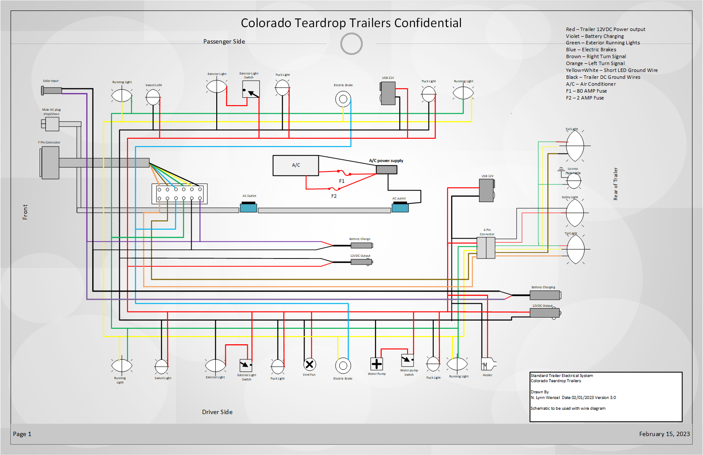

# Knoeller Colorado Teardrop Mount Massive Manual

- [Knoeller Colorado Teardrop Mount Massive Manual](#knoeller-colorado-teardrop-mount-massive-manual)
  - [Vehicle Needs](#vehicle-needs)
    - [Electrical](#electrical)
    - [Hitch](#hitch)
  - [Weight Distribution](#weight-distribution)
  - [Electric Brake Controller Settings](#electric-brake-controller-settings)
  - [Checklists](#checklists)
    - [Departure Checklist](#departure-checklist)
    - [Arrival Checklist](#arrival-checklist)
    - [Road Stop Checklist](#road-stop-checklist)
  - [Detailed Documentation](#detailed-documentation)
    - [Electrical](#electrical-1)
    - [Replacement Parts](#replacement-parts)

## Vehicle Needs

### Electrical

- Vehicle side standard seven pin wiring harness
- Brake controller is one of seven pins
  -  We have a wired controller
  -  You could use a wireless controller like [this one](https://www.amazon.com/CURT-51180-Controller-Bluetooth-Enabled-Proportional/dp/B07JQ99SDD/ref=sr_1_2_sspa?crid=3DZNIG5GPS6B8&keywords=wireless%2Bbrake%2Bcontroller&qid=1681731866&sprefix=wireless%2Bbrake%2Bcontrolle%2Caps%2C95&sr=8-2-spons&spLa=ZW5jcnlwdGVkUXVhbGlmaWVyPUFPVU81WFRLMExVVDMmZW5jcnlwdGVkSWQ9QTAxODE2NzdJNFo4QTRRUDVJM1ImZW5jcnlwdGVkQWRJZD1BMDQ5NDQyNjJGQ0dYVDI2UTFWTVQmd2lkZ2V0TmFtZT1zcF9hdGYmYWN0aW9uPWNsaWNrUmVkaXJlY3QmZG9Ob3RMb2dDbGljaz10cnVl&th=1)
  -  Wired is considered safer in case you need to quickly manually active brakes (e.g. sway instability event) - but I've never had this happen

### Hitch

- We use a Lock-n-roll trailer side attachmentt
- Requires towing vehicle have lock-n-roll vehicle side hitch
  - For the Highlander, we use [part 511 - Slides into a standard, 2" receiver tube. Can be set 2 1/2" higher or lower than receiver tube.](https://locknroll.com/shop-now/?route=product/product&product_id=21)
  - You will need the appropriate hitch height for your vehicle (Mount Massive is level with vehicle lock-n-roll at 19" - e.g. our receiver midpoint on Highlander is at 16.5", so we need a 2.5" lift in our lock-n-roll vehicle receiver)

## Weight Distribution

- You want 10-15% of trailer weight to be on the tongue for trailer stability safety
- But you also need to pay attention to your vehicle hitch weight constraints (e.g. highlander 350 lb) 

## Electric Brake Controller Settings

- Follow instructions for your brake controller to calibrate the gain (strength)
- You do not want to be dragging tires, ever
  - This will rapidly wear out the $300 ea all-terrain tires

## Checklists

### Departure Checklist

- Awning
  - Folded away, velcro'd shut, zipped closed
- Cabin
  - 2 wooden bars replaced on storage bin side
  - Turn off fan and close fan hatch
  - Close & latch side door windows
  - Ensure interior lights are all off
  - Ensure side door flood lights are off
  - Deadbolt side doors
  - Verify side doors are locked manually
- Electrical
  - Disconnect 110 volt and stow extension cable
  - Verify fridge is running off of battery
  - Check battery charge level for the day
- Leveling Jacks
  - Ensure wheel chalks are secure
  - Bring down leveling jacks, remove and store
- Galley
  - Ensure galley lights are off
  - Ensure stopping pin is in fridge slider
  - Stow items / clear stainless work area
  - Ensure stopping pin is in galley swing doors
  - Shut galley, rotate galley locks 90 degrees, lock
  - Verify galley locks by hand
- Trailer hook-up
  - Crank up trailer tongue jack
  - Back up vehicle to trailer
  - Lower tongue jack
  - Place hitch pin in lock-n-roll
  - Insert cotter pin into hitch pin to lock
  - Attach 2 safety chains in X patern under hitch
  - Loop electrical harness one extra time around trailer if necessary to prevent dragging
  - Connect 7 pin electrical haraness to vehicle
- Tongue Box
  - Remove chalks and place in tongue box
  - Place stool, foot mat, foot washing tub in tongue box
  - Lock tongue box
  - Confirm tongue box lock by hand (attempt to open)
- Before driving
  - Walk around car and trailer to ensure everything is secure and nothing is still attached to the trailer or car (e.g. laundry line!)
  - Check tire pressure (at least visually) on trailer and tow vehicle
  - Check propane tank valve is off
  - Check gas on vehicle
  - Check trailer lights (turn signals, emergency blinkers)
  - Verify brake controller is set to desired gain

### Arrival Checklist

- Trailer Position
  - Scope out where the sun will track at your camp site
    - I use [Android Sunnytrack](https://play.google.com/store/apps/details?id=com.sunnytapps.sunnytrack&hl=en_US&gl=US&pli=1) it has nice AR overlay on phone camera
  - Use trees for sun cover where possible
  - If possible, place awning  opening away from sun for maximum shade
- Place trailer chalk under up-hill trailer tire (you will be jacking up the downhill side)
- Rotate tongue jack, place pin and crank trailer up
  - Sometimes I have to lift the trailer tongue a couple inches to get the jack to swivel fully down / place pin
- Drive vehicle out from under the trailer tongue
- Level trailer
  - I use a soda can or other round object to roll-test forward-backward and side-to-side level
  - Jack up low-side trailer
  - Adjust tongue jack
  - Repeat till rolling object does not roll
- Hook up electrical
  - 110V extension cord to front starbard weather sealed plug-in
  - Pull out Charge Queen Lithium battery charger, connect alligator clamps to pos / neg battery terminals in trailer galley and plug in to 110V in lower galley
- Awning install if desired
  - Awning Damage Potential
    - Level the trailer before deploying awning. Potential for damage to awning if you level after deploy.
    - Awning is a giant sail, so really keep an eye on wind levels to prevent damage
    - If wind predictions are for 20 MPH+ I don't deploy.
    - Always ensure it's very well staked down
  - Unzip and un-velcrow awning
  - Rotate the aluminum arms out, attach nylon tensioners to trailer roof rack rear and fore, apply tension (awning doesn't have to be totally flat / tension at maybe 20-30 lb?)
  - Un-velcrow the built-in stabilizing legs and extend them / lock them by rotating them. I normally apply just a bit of upward pressure before locking them (pushing up the aluminum support arms slightly)
  - Pin these same stabilizing legs DOWN by use of the ground stakes
  - Take two additional stabilizing legs from storage and slot them into round holes in A: the most forward aluminum arm and B: the aluminum arm pointed tot rear near the galley.  I do not typically put the third in (which would go to port side of the galley). That third arm is so short and has little to support IMO.
  - Stake these two additional support legs and apply substantial stake tension.
- Clean cabin entry
  - Place foot mat, foot washing tub, stool at doorway of trailer
- Ventilation
  - Crank open roof vent in cabin
    - If no rain possible, crank open ~7 inches
    - If light rain is possible, crank open at most 1-2" (with vent blowing OUT, rain isn't getting in)
    - If downpour is possible, Crank open only until sliver of light is visible
  - When desired, turn on vent fan
    - Blow OUT of cabin to cool cabin and prevent rain from getting in through vent
    - Blow IN to cabin when running heater to mix air and draw in light fresh air
    - Adjust side windows and / or top vent crank to achieve air flow desired
  - 

### Road Stop Checklist

I do this every time we stop - just to verify we re-locked everything and are in good shape to drive again. I've caught issues by this checklist!

- Test wheel hub temperature by hand (likely warm to touch but not unbearably hot)
  - If unbearably hot -- bearing issues
- Double check trailer hook-up from Departure Checklist
- Re verify all locks are locked (manually try to open both cabin doors, both rear galley handles, and the tongue box)
- Check tire pressure (at least visually) on trailer and tow vehicle

## Detailed Documentation

### Electrical Wiring Diagrams and Troubleshooting

- [Colorado Teardrops Electrical Troubleshooting Doc](documentation/electrical_troubleshooting.pdf)

As Colorado Teardrops has gone out of business, I feel it's appropriate to post Proprietary wiring documentation for owners of now-unsupported trailers. I would note I have two electrical diagrams and they don't seem to be entirely in agreement (The second diagram is perhaps just more detailed?)

### Replacement Parts

- Door stops for cabin doors (mounted on exterior)
  - Deltana Enterprises Inc WB100U26D
- Greas seals for bearing hand packing
  - P104{6|8|5}9 TB 1.719 2.561 0.500
  - Might be Dexter PN 010-019-00
  - NAPA PN NOS 17144
- Hubs are Dexter 8-247's with 5 bolts
